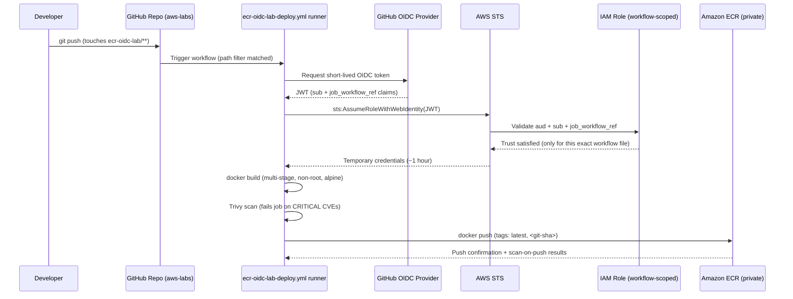

# Architecture

No AWS access keys ever exist in GitHub. Every push exchanges a short-lived
OIDC token for temporary AWS credentials scoped to one IAM role, which can
only push/pull one ECR repository.

This lab lives inside `1MuhireDavid/aws-labs`, a single repo that hosts
many labs. Two things in this design exist specifically because of that:

1. The workflow (`.github/workflows/ecr-oidc-lab-deploy.yml`) has a `paths`
   filter so it only runs on commits that touch `ecr-oidc-lab/**` — pushes
   to other labs in the repo don't trigger a build here.
2. The IAM trust policy checks **both** `sub` (repo + branch) **and**
   `job_workflow_ref` (the exact workflow file). Repo + branch alone would
   let *any* lab's workflow in this repo assume this role, since they all
   share the same repo and the same `main` branch.

## Why this is least-privilege

| Layer | Control |
|---|---|
| Workflow trigger | `paths: ['ecr-oidc-lab/**', ...]` — other labs' commits never invoke this workflow at all |
| Workflow token | `permissions: id-token: write, contents: read` only — no other GITHUB_TOKEN scopes |
| Trust policy | `StringEquals` on `aud`; `StringLike` on **both** `sub` (org/repo/branch) **and** `job_workflow_ref` (this exact `.yml` file) — a token minted by a different lab's workflow in the same repo/branch fails the second check and is rejected by AWS at `AssumeRoleWithWebIdentity` time |
| IAM permissions | Six `ecr:*` actions needed to push an image, scoped via `Resource` to a single repository ARN (only `ecr:GetAuthorizationToken` must be `"*"`, an AWS API constraint) |
| ECR repository policy | Defense in depth — the repository itself also only accepts push/pull from the one deploy role's ARN |
| Naming | `RoleName`, `EcrRepositoryName`, and the CloudFormation stack name are all lab-specific (`ecr-oidc-lab-*`) so this lab's stack coexists cleanly with other labs' stacks in the same AWS account |
| Credentials | Temporary STS session credentials, ~1 hour lifetime, never stored anywhere |
