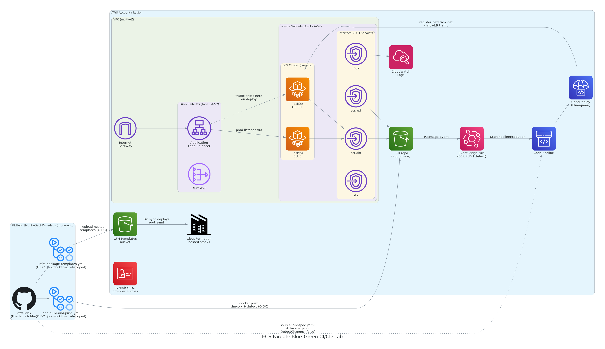

# ECS Fargate Blue/Green CI/CD Lab

Lives inside [`1MuhireDavid/aws-labs`](https://github.com/1MuhireDavid/aws-labs)
alongside your other labs. Everything for this lab is scoped to this
folder plus two path-filtered workflow files at the repo root (GitHub
only reads workflows from `.github/workflows/` at the repo root, even in
a monorepo).

A highly available, containerized fullstack Java app on **Amazon ECS
Fargate**, in a custom multi-AZ VPC, behind a public ALB, deployed via
**CodePipeline + CodeDeploy blue/green**, triggered automatically by
container image pushes. All infrastructure is **CloudFormation**,
deployed via **Git sync**; all CI/CD-to-AWS calls use **OIDC**.

```
aws-labs/                                          <- your existing repo
├── .github/workflows/
│   ├── ecs-bluegreen-lab-infra-package-templates.yml   (path-filtered to infra/)
│   └── ecs-bluegreen-lab-app-build-and-push.yml         (path-filtered to app/)
└── ecs-fargate-bluegreen-cicd-lab/                 <- everything below is new
    ├── README.md                (this file)
    ├── infra/                   -> cfn/, scripts/, README.md
    ├── app/                     -> src/, Dockerfile, ecs/, README.md
    └── diagram/                 -> architecture.py + architecture.png
```

## Why two workflows, one repo, and how isolation still holds

Since this repo holds multiple labs, both GitHub Actions workflows are
**path-filtered** (`on.push.paths`) so neither one fires on a change to
a different lab, and neither fires on the other's files. That solves
*noise*. It does not, by itself, solve *privilege isolation* — a repo-
scoped OIDC trust policy (`repo:org/repo:ref:refs/heads/main`) would let
**either** workflow assume **either** role, since both run from the same
repo and branch.

The fix, in `infra/cfn/bootstrap/00-bootstrap.yaml`: each IAM role's trust
policy also checks GitHub's `job_workflow_ref` OIDC claim, which encodes
the exact calling workflow file
(`1MuhireDavid/aws-labs/.github/workflows/<file>.yml@refs/heads/main`).
So the infra-packaging role can only ever be assumed by
`ecs-bluegreen-lab-infra-package-templates.yml`, and the ECR-push role
only by `ecs-bluegreen-lab-app-build-and-push.yml` — full isolation
despite sharing a repo, a branch, and a secrets store.

## Architecture



- **Network:** 1 VPC, 2 AZs, 2 public + 2 private subnets, 1 NAT Gateway
  (parameterized to 2 for full HA egress).
- **Compute:** ECS Fargate tasks in **private** subnets only, no public
  IPs. Pulled images, shipped logs, and STS calls all travel over
  **interface VPC endpoints** (`ecr.api`, `ecr.dkr`, `logs`, `sts`) plus a
  free **S3 gateway endpoint** for ECR's underlying layer storage —
  steady-state traffic never needs the NAT Gateway.
- **Exposure:** a public **ALB** is the only internet-facing resource;
  security groups form a strict chain (Internet → ALB SG → ECS task SG →
  VPC endpoint SG), least privilege at every hop.
- **Scaling:** target-tracking on `ECSServiceAverageCPUUtilization`,
  1 (min) / 1 (desired) / 4 (max) tasks.
- **Deploy:** ECS service uses `DeploymentController: CODE_DEPLOY`.
  EventBridge watches ECR for a `PUSH` of the `:latest` tag, starts
  CodePipeline, which hands the new image + `appspec.yaml`/`taskdef.json`
  to CodeDeploy for a blue/green traffic shift. The pipeline's GitHub
  source action has `DetectChanges: false` deliberately — see
  `infra/README.md` — so it never self-triggers on unrelated monorepo
  commits; EventBridge is the sole trigger.
- **IaC delivery:** CloudFormation **Git sync** deploys `infra/cfn/root.yaml`
  straight from this repo on every push to `main`; nested stack templates
  are hosted in S3 (bucket created by a one-time bootstrap stack) since
  Git sync has no built-in `cfn package` step.
- **CI/CD auth:** both workflows authenticate to AWS via **OIDC**
  (`sts:AssumeRoleWithWebIdentity`), each scoped to its own exact workflow
  file (see above), zero stored AWS keys.

## Setup order (full detail in `infra/README.md` and `app/README.md`)

Every step below is done in the **AWS Console** or **GitHub's web UI** —
no CLI or scripts required (an optional CLI script exists for step 1 if
you'd rather script it; see `infra/README.md`).

1. Deploy `infra/cfn/bootstrap/00-bootstrap.yaml` **once**, manually, via
   **CloudFormation → Create stack → Upload a template file** in the
   Console. Creates the S3 templates bucket, GitHub OIDC provider, and
   two scoped OIDC roles. Note the three Output values.
2. Add those values as **repository secrets** in GitHub (Settings →
   Secrets and variables → Actions), and fill the two placeholders in
   `infra/cfn/deployment-file.yaml` (bucket name, your full name) —
   editable directly in GitHub's web UI.
3. Push (or commit via GitHub's web UI) → the path-filtered
   `ecs-bluegreen-lab-infra-package-templates.yml` workflow runs
   automatically, uploads nested templates to S3, stamps a
   `TemplatesVersion`.
4. In the CloudFormation Console, turn on **Git sync**, pointing at
   `ecs-fargate-bluegreen-cicd-lab/infra/cfn/deployment-file.yaml`. Merge
   the PR it opens.
5. In the CloudFormation Console (Developer Tools → Settings →
   Connections), authorize the `GitHubConnection` (one click) so
   CodePipeline's GitHub source action can read
   `ecs-fargate-bluegreen-cicd-lab/app/ecs/`.
6. Fill in `app/ecs/taskdef.json`'s three placeholders directly in
   GitHub's web editor, commit. Then push a change under
   `ecs-fargate-bluegreen-cicd-lab/app/` → the path-filtered
   `ecs-bluegreen-lab-app-build-and-push.yml` workflow builds/pushes the
   image, EventBridge fires, CodePipeline runs, CodeDeploy shifts traffic
   blue → green.
7. Open the ALB DNS name — CloudFormation Console → root stack →
   **Outputs** tab → `AlbEndpoint`.

## Deliverables checklist

| Deliverable | Where |
|---|---|
| Infra CloudFormation | `ecs-fargate-bluegreen-cicd-lab/infra/` in this repo |
| App code + Dockerfile + build/deploy files | `ecs-fargate-bluegreen-cicd-lab/app/` in this repo |
| ALB endpoint | CloudFormation output `AlbEndpoint` on the root stack, after step 6 |
| Architecture diagram (diagram-as-code) | `diagram/architecture.py` → `diagram/architecture.png` |

## Rubric → implementation map

| Rubric item | Implementation |
|---|---|
| Multi-AZ VPC, correct subnets | `infra/cfn/modules/01-network.yaml` |
| Private ECS + VPC endpoints + public ALB | `03-ecr-endpoints.yaml`, `04-alb-ecs.yaml` |
| Least-privilege security groups | `02-security.yaml` (strict SG-to-SG chain) |
| All resources via CFN + Git sync | `infra/cfn/root.yaml` + `deployment-file.yaml` |
| GitHub Actions builds & pushes image | `.github/workflows/ecs-bluegreen-lab-app-build-and-push.yml` |
| OIDC auth (no long-lived secrets) | Both workflows use `role-to-assume`; roles + `job_workflow_ref` scoping in `00-bootstrap.yaml` |
| Consistent + mutable tagging | `:sha-<gitsha>` (immutable) + `:latest` (mutable, MUTABLE repo) — see `app/README.md` |
| App accessible via ALB | `AlbEndpoint` output |
| ALB health checks pass | Health check path `/`, answered by both the bootstrap placeholder and the real app |
| CloudWatch Logs | `awslogs` driver → `/ecs/<project>-app` log group |
| Auto scaling 1–4 on CPU | `ScalableTarget` / `CpuScalingPolicy` in `04-alb-ecs.yaml` |
| Blue/green deployment | `05-cicd-pipeline.yaml`: CodeDeploy `BLUE_GREEN` + `WITH_TRAFFIC_CONTROL`, two target groups |

## Regenerating the diagram

```bash
pip install diagrams --break-system-packages   # also requires the `graphviz` system package
cd diagram && python3 architecture.py
```
